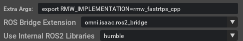

# Robotics Assignment

## Setup the repo
1. Open a terminal and create directory in Documents:
```bash
cd ~/Documents
mkdir -p course/robotics_ws/src
cd ~/Documents/course/robotics_ws/src
```

2. Clone down this repository:
```bash
git clone https://github.com/MohismLab/robotics_assignment_part2.git
```

## Local Environment Setup
### Build Docker ROS 2 Image
1. Navigate to the directory containing the `DOCKERFILE`.

2. Build the Docker image:
```bash
docker build -t <YOUR_IMAGENAME> .
```
Example:
```bash
docker build -t env_isaacsim .
```

3. Run the Docker container, replacing `<YOUR_CONTAINER_NAME>` and `<YOUR_IMAGENAME>`:
```bash
docker run -it \
    --name <YOUR_CONTAINER_NAME> \
    --network host \
    --env="DISPLAY" \
    --env="QT_X11_NO_MITSHM=1" \
    --volume="/tmp/.X11-unix:/tmp/.X11-unix:rw" \
    --volume="<YOUR_PATH>/humble_ws:/root/humble_ws" \
    <YOUR_IMAGENAME>
```
Example:

```bash
docker run -it \
    --name container_isaacsim \
    --network host \
    --env="DISPLAY" \
    --env="QT_X11_NO_MITSHM=1" \
    --volume="/tmp/.X11-unix:/tmp/.X11-unix:rw" \
    --volume="/home/ubuntu-user/Documents/course/robotics_ws:/root/humble_ws" \
    env_isaacsim
```

#### Start the Docker container
1. Start the Docker container and access its shell:

```bash
docker start <YOUR_CONTAINER_NAME> && docker exec -it <YOUR_CONTAINER_NAME> /bin/bash
```
Example:
```bash
docker start container_isaacsim && docker exec -it container_isaacsim /bin/bash
```

If `rviz` is needed, run the following command to allow local connections to the X server from the specified Docker container:
    
```bash
xhost +local:$(docker inspect --format='{{ .Config.Hostname }}' <YOUR_CONTAINER_NAME>) && docker start <YOUR_CONTAINER_NAME> && docker exec -it <YOUR_CONTAINER_NAME> /bin/bash
```

Example:
```bash
xhost +local:$(docker inspect --format='{{ .Config.Hostname }}' container_isaacsim) && docker start container_isaacsim && docker exec -it container_isaacsim /bin/bash
```

1.1. Install Dependency 

Ensure you have rebuild your docker images docker images with [following packages](https://github.com/MohismLab/robotics_assignment_part2/blob/4fbe9c2b838c3a7b08a06021ea89b5684357c319/Dockerfile#L18). Otherwise, you can install them via following command.
```sh
apt install ros-humble-tf-transformations
apt install ros-humble-navigation2 \ 
            ros-humble-nav2-bringup
```

#### Start the Isaacsim
##### Option 1: Start by terminal(Recommended)
To start the isaacsim using another terminal, run:
```bash
cd ~/.local/share/ov/pkg/isaac-sim-4.2.0
export ROS_DISTRO=humble
export FASTRTPS_DEFAULT_PROFILES_FILE=~/Documents/course/robotics_ws/src/robotics_assignment_part2/fastdds.xml
export LD_LIBRARY_PATH=$LD_LIBRARY_PATH:~/.local/share/ov/pkg/isaac-sim-4.2.0/exts/omni.isaac.ros2_bridge/humble/lib
export ROS_DOMAIN_ID=<a number>
. ./isaac-sim.sh 
```
You can find your ROS_DOMAIN_ID `<a number>` in this [link](https://docs.google.com/spreadsheets/d/1kC7gXXYbdRqgV7mz5oa8AHA5-ZvLCW_N/edit?gid=1509629307#gid=1509629307).

##### Option 2: Start by Isaac Sim Selector
You can start selecter either by omniverse launcher or by terminal. When launching Isaac Sim from the NVIDIA Omniverse Launcher, set `export RMW_IMPLEMENTATION=rmw_fastrtps_cpp` under "Extra Args" to ensure it uses the correct ROS 2 configuration.



When isaacsim start, import environment usd file by navigate to <robotics_assignment_part2/ros/usd/world.usd> at content  


#### Inside Docker Container
##### Set ROS_DOMAIN_ID
To set the `ROS_DOMAIN_ID` and avoid communication conflicts:
```bash
export RMW_IMPLEMENTATION=rmw_fastrtps_cpp
export ROS_DOMAIN_ID=<a number>
```
Or add the following line to your `~/.bashrc` file
```bash
echo 'export ROS_DOMAIN_ID=<a number>' >> ~/.bashrc
. ~/.bashrc
```
##### Set DDS 
```bash
export FASTRTPS_DEFAULT_PROFILES_FILE=/root/humble_ws/src/robotics_assignment_part2/fastdds.xml
```
You can check your environment variables by
```bash
env
```
If there is `RMW_IMPLEMENTATION=`, disable it by:
```bash
unset RMW_IMPLEMENTATION
```

### How to Run ROS Node Inside Docker Container
#### Concol Build related Packages and Source
1. Open a terminal and create directory inside humble_ws inside docker after starting [the docker container](#Start-the-Docker-container):
```bash
colcon build
source install/setup.bash
```

#### Firstly Run Isaac Sim
Start `robotics_assignment_part2/ros/usd/world.usd`. There should be a TurtleBot surrounded by walls, and also a cylinder.

#### To Run Potential Field Navigation:

```sh
ros2 run robotics_assignment_part2 potential_field_navigation
```
You can have a look at video demo via this [link](https://drive.google.com/file/d/13TY-EtgryuxA52AiRZRzQjXBo5nqreOY/view?usp=sharing).

#### To Run RRT Navigation:
```sh
ros2 launch robotics_assignment_part2 rrt_navigation.launch.py
```

Open another terminal, run 
```sh
# to set a goal
ros2 topic pub /move_base_simple/goal geometry_msgs/PoseStamped "{header: {frame_id: 'map'}, pose: {position: {x: 1.8, y: 1.8, z: 0.0}, orientation: {x: 0.0, y: 0.0, z: 0.0, w: 1.0}}}"
```
You can have a look at video demo via this [link](https://drive.google.com/file/d/1XpqhuIKPXjvyhsF4UshHsSLvR_Ht8N21/view?usp=sharing).

#### To Run RViz for RRT Navigation:
Open third terminal and create directory inside humble_ws inside docker after starting [the docker container](#Start-the-Docker-container), and run the following script:

```sh
rviz2 -d /YOUR_PATH/robotics_assignment_part2/rviz.rviz
```

Example:
```sh
rviz2 -d ~/humble_ws/src/robotics_assignment_part2/rviz.rviz
```
You can have a look at video demo via this [link](https://drive.google.com/file/d/1ErcEZxq5tYg09DELUEAWk5ROuyroIbAu/view?usp=sharing).


#### To View the Result Plots
After the programme finish, open the forth terminal and create directory inside humble_ws inside docker after starting [the docker container](#Start-the-Docker-container), and run the following script:

```sh
python3 src/robotics_assignment_part2/robotics_assignment_part2/ros/plot_trajectory.py 
```


## Troubleshooting
### DDS Issues
If there are some issues when using `fastrtps` as dds, you can try below to change to `cyclonedds`.
In ros2 docker container, run:
```bash
export RMW_IMPLEMENTATION=rmw_cyclonedds_cpp
```

Make sure there is no any process that runs ROS2:
```bash
ps -ax
kill -9 <PID>
```

Example:
```bash
ps -ax

    PID TTY      STAT   TIME COMMAND
    147 pts/1    Sl     0:00 /usr/bin/python3 -c from ros2cli.daemon.daemonize import main; main() --n

kill -9 147
```

And restart ROS2：
```bash
ros2 daemon stop
ros2 daemon start
```
